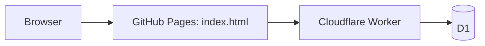

# ARCHITECTURE.md

```mermaid
flowchart LR
  Browser --> Pages[GitHub Pages: index.html]
  Pages --> Worker[Cloudflare Worker]
  Worker --> D1[(D1)]
```

## Decisions
- ADR-001: <title>, see docs/ADR-001.md

## Trust Boundary
<What crosses from the browser to the Worker to any outside service, and what never does.>
